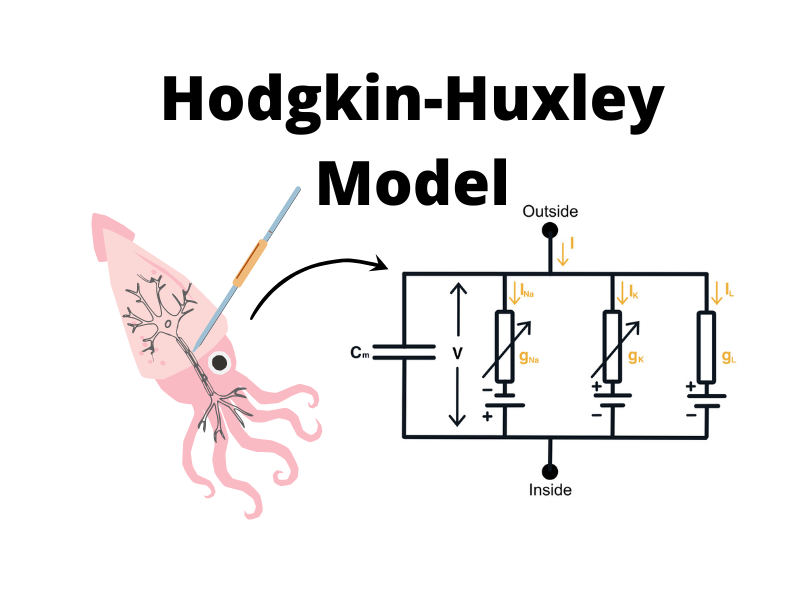

# Hodgkin-Huxley Model
Implementation of the Hodgkin-Huxley model for the [blog post](https://perceptron.blog/hodgkin-huxley) on perceptron.blog.

    

There are two versions of the model:

| Version              | Link |
|----------------------| ---- |
| The original model   | [notebook](/notebooks/a_type_model.ipynb) |
| A-Type Current Model | [notebook](/notebooks/single_compartment_model.ipynb) |

